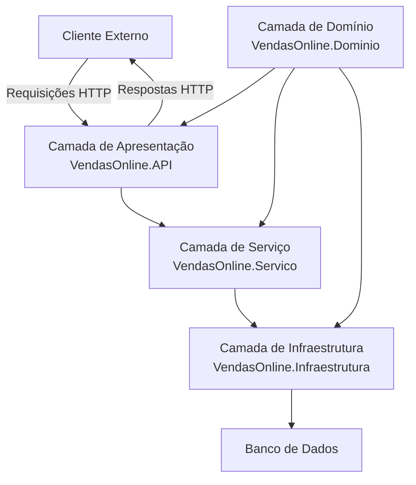

# xpe-desafio-final-arquitetura-software

Abaixo está o conteúdo de um arquivo **README.md** para o projeto da API de Vendas Online, projetado para ser claro, profissional e informativo, adequado para o repositório no GitHub. O README inclui uma visão geral do projeto, instruções para configuração e execução, detalhes da arquitetura, tecnologias utilizadas (com ênfase no .NET 9), e outras informações relevantes. Ele reflete as informações dos documentos fornecidos (**infosXPE.txt**, **DesafioFinalArqSoft.pdf**) e atende às boas práticas para documentação de projetos open-source.

---

# API de Vendas Online

[](https://dotnet.microsoft.com/download/dotnet/9.0)

Bem-vindo ao repositório da **API de Vendas Online**, um projeto desenvolvido como desafio final para o Bootcamp de Arquitetura de Software. Esta é uma API RESTful construída com **.NET 9**, projetada para gerenciar operações de e-commerce, incluindo produtos, clientes e pedidos. A aplicação segue uma arquitetura em camadas, baseada no padrão MVC, com foco em manutenibilidade, escalabilidade e separação de responsabilidades.

## Visão Geral

A API de Vendas Online oferece endpoints RESTful para operações CRUD (Create, Read, Update, Delete) de entidades como `Produto`, `Cliente` e `Pedido`. Ela implementa validação de dados, tratamento de erros, persistência em banco de dados relacional e documentação interativa via Swagger. O projeto foi estruturado em quatro camadas:
- **VendasOnline.API**: Camada de apresentação com controladores REST.
- **VendasOnline.Dominio**: Camada de domínio com entidades, interfaces e DTOs.
- **VendasOnline.Servico**: Camada de serviço com lógica de negócio.
- **VendasOnline.Infraestrutura**: Camada de acesso a dados com repositórios e contexto do banco.

## Funcionalidades

- **Gerenciamento de Produtos**: Criar, listar, atualizar e remover produtos com informações como nome, preço e estoque.
- **Gerenciamento de Clientes**: Cadastrar, consultar, editar e excluir clientes, com validação de CPF e e-mail únicos.
- **Gerenciamento de Pedidos**: Criar e gerenciar pedidos, incluindo itens associados a produtos e status (Pendente, Processando, etc.).
- **Validação de Dados**: Regras robustas de validação usando FluentValidation.
- **Documentação da API**: Interface Swagger para explorar e testar endpoints.
- **Tratamento de Erros**: Middleware personalizado para respostas de erro padronizadas.

## Tecnologias Utilizadas

- **.NET 9**: Framework principal para desenvolvimento da API.
- **ASP.NET Core**: Para construção de endpoints RESTful.
- **Entity Framework Core**: ORM para persistência de dados no SQL Server.
- **FluentValidation**: Validação de dados de entrada.
- **AutoMapper**: Mapeamento entre entidades e DTOs.
- **Swashbuckle (Swagger)**: Documentação interativa da API.
- **SQL Server**: Banco de dados relacional (suporta LocalDB ou instâncias remotas).
- **Git**: Controle de versão.

## Pré-requisitos

Antes de executar o projeto, certifique-se de ter os seguintes requisitos instalados:
- [.NET 9 SDK](https://dotnet.microsoft.com/download/dotnet/9.0)
- [SQL Server](https://www.microsoft.com/sql-server) ou LocalDB
- [Entity Framework Core CLI](https://docs.microsoft.com/ef/core/cli/dotnet) (`dotnet tool install --global dotnet-ef`)
- IDE recomendada: [Visual Studio 2022](https://visualstudio.microsoft.com) ou [VS Code](https://code.visualstudio.com)
- Opcional: [Postman](https://www.postman.com) para testar endpoints

## Como Executar o Projeto

Siga os passos abaixo para configurar e executar a API localmente:

1. **Clonar o Repositório**:
   ```bash
   git clone https://github.com/NFPN/xpe-desafio-final-arquitetura-software
   cd xpe-desafio-final-arquitetura-software
   ```

2. **Restaurar Dependências**:
   Navegue até o diretório raiz (onde está o arquivo `VendasOnline.sln`) e execute:
   ```bash
   dotnet restore
   ```

3. **Configurar a String de Conexão**:
   Abra o arquivo `VendasOnline.API/appsettings.json` e configure a conexão com o banco de dados:
   ```json
   "ConnectionStrings": {
     "DefaultConnection": "Server=(localdb)\\mssqllocaldb;Database=VendasOnlineDb;Trusted_Connection=True;MultipleActiveResultSets=true"
   }
   ```
   Ajuste o `Server` conforme seu ambiente SQL Server.

4. **Aplicar Migrações do Banco de Dados**:
   No diretório `VendasOnline.Infraestrutura`, execute:
   ```bash
   dotnet ef migrations add InitialCreate
   dotnet ef database update
   ```
   Isso criará o banco de dados `VendasOnlineDb` e aplicará o esquema inicial.

5. **Executar a API**:
   No diretório raiz, execute:
   ```bash
   dotnet run --project VendasOnline.API
   ```
   Ou, no Visual Studio, defina `VendasOnline.API` como projeto de inicialização e pressione F5.

6. **Acessar a API**:
   - A API estará disponível em `https://localhost:5001` (ou a porta configurada).
   - Abra o Swagger UI em `https://localhost:5001/swagger` para explorar e testar os endpoints.

7. **Testar Endpoints**:
   Use o Swagger UI ou Postman para testar endpoints, como:
   - `GET /api/produtos`: Lista todos os produtos.
   - `POST /api/clientes`: Cria um novo cliente (exemplo de payload):
     ```json
     {
       "nome": "João Silva",
       "email": "joao.silva@example.com",
       "cpf": "123.456.789-00",
       "telefone": "11987654321",
       "ativo": true
     }
     ```

## Estrutura do Projeto

A solução está organizada em quatro projetos:

```
VendasOnline/
├── VendasOnline.sln
├── VendasOnline.API/
│   ├── Controllers/
│   ├── Configuracoes/
│   ├── Middlewares/
│   ├── Validadores/
│   ├── Program.cs
│   ├── appsettings.json
├── VendasOnline.Dominio/
│   ├── Entidades/
│   ├── Interfaces/
│   ├── Enums/
│   ├── DTOs/
├── VendasOnline.Servico/
│   ├── Servicos/
│   ├── Validadores/
├── VendasOnline.Infraestrutura/
│   ├── Contexto/
│   ├── Repositorios/
│   ├── Migrations/
```

### Camadas da Arquitetura

- **VendasOnline.API**: Contém controladores REST, configurações (AutoMapper, Swagger, Injeção de Dependência) e middlewares.
- **VendasOnline.Dominio**: Define entidades (`Produto`, `Cliente`, `Pedido`, `ItemPedido`), interfaces, enums (`StatusPedido`) e DTOs.
- **VendasOnline.Servico**: Implementa a lógica de negócio, orquestrando operações entre controladores e repositórios.
- **VendasOnline.Infraestrutura**: Gerencia o acesso ao banco de dados via Entity Framework Core, com repositórios e contexto.

## Endpoints Disponíveis

### Produtos
- `GET /api/produtos`: Lista todos os produtos.
- `GET /api/produtos/{id}`: Obtém um produto por ID.
- `GET /api/produtos/nome/{nome}`: Busca produtos por nome.
- `POST /api/produtos`: Cria um novo produto.
- `PUT /api/produtos/{id}`: Atualiza um produto existente.
- `DELETE /api/produtos/{id}`: Remove um produto.

### Clientes
- `GET /api/clientes`: Lista todos os clientes.
- `GET /api/clientes/{id}`: Obtém um cliente por ID.
- `GET /api/clientes/nome/{nome}`: Busca clientes por nome.
- `POST /api/clientes`: Cria um novo cliente.
- `PUT /api/clientes/{id}`: Atualiza um cliente existente.
- `DELETE /api/clientes/{id}`: Remove um cliente.

### Pedidos
- `GET /api/pedidos`: Lista todos os pedidos.
- `GET /api/pedidos/{id}`: Obtém um pedido por ID.
- `GET /api/pedidos/nome/{nome}`: Busca pedidos por nome do cliente.
- `POST /api/pedidos`: Cria um novo pedido.
- `PUT /api/pedidos/{id}`: Atualiza um pedido existente.
- `DELETE /api/pedidos/{id}`: Remove um pedido.

## Diagrama da Arquitetura

A arquitetura segue o modelo C4 (nível 2), conforme ilustrado:

Mermaid


## Possíveis Melhorias Futuras

- **Autenticação e Autorização**: Implementar JWT ou OAuth2 para segurança.
- **Testes Automatizados**: Adicionar testes unitários e de integração com xUnit.
- **Paginação e Cache**: Suporte a paginação em listas e cache para desempenho.
- **Logging Avançado**: Integrar Serilog para monitoramento detalhado.
- **CQRS**: Separar operações de leitura e escrita para cenários de alta carga.
- **Versionamento da API**: Adicionar suporte a múltiplas versões da API.

## Contribuição

Contribuições são bem-vindas! Para contribuir:
1. Faça um fork do repositório.
2. Crie uma branch para sua feature (`git checkout -b feature/nova-funcionalidade`).
3. Commit suas alterações (`git commit -m 'Adiciona nova funcionalidade'`).
4. Envie para o repositório remoto (`git push origin feature/nova-funcionalidade`).
5. Abra um Pull Request.

## Contato

Mande para este [email](mailto:natanaelfpnunes@gmail.com)


